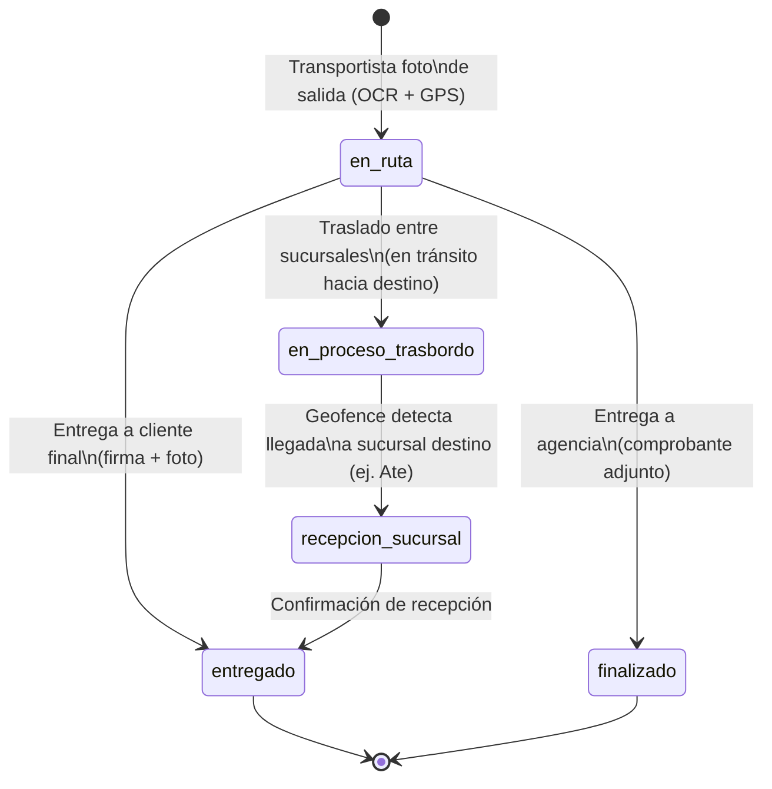

# Arquitectura de la Aplicación — Proyectos IPESA

Aplicación móvil para transportistas de IPESA que digitaliza el control de
guías de despacho: captura fotográfica, reconocimiento óptico de caracteres
(OCR), geolocalización obligatoria, geofencing en sucursales y registro de
estados en una base de datos centralizada sobre Google Sheets.

## 1. Resumen ejecutivo

| | |
|---|---|
| **Objetivo** | Eliminar el registro manual de guías, reducir duplicados y dar trazabilidad en tiempo real del ciclo "en ruta → entregado / recepción en sucursal". |
| **Usuarios** | Transportistas, Administradores, Equipo Comercial / Visualizadores. |
| **Plataformas** | App móvil multiplataforma (Android / iOS) + panel de administración. |
| **Dato crítico** | Número de guía, extraído por OCR, es la llave única de cada tarea. |
| **Restricción dura** | No se puede subir ningún registro fotográfico sin GPS activo. |

## 2. Stack tecnológico

### 2.1 Framework de la app móvil

| Criterio | Flutter | React Native |
|---|---|---|
| Rendimiento cámara/OCR en tiempo real | Alto (compilado a nativo, buen soporte de `camera` + `google_ml_kit`) | Alto, pero depende más de librerías nativas puente |
| Ecosistema de geolocalización/geofencing | `geolocator`, `flutter_background_geolocation` | `react-native-geolocation`, `react-native-background-geolocation` |
| Integración Google Sheets/OAuth | Vía paquetes HTTP + `googleapis` (server) o `gsheets` | Similar, vía `googleapis` (Node) o REST directo |
| Curva de equipo | A definir según stack del equipo actual | A definir según stack del equipo actual |

**Recomendación:** Flutter, por rendimiento nativo consistente en cámara/OCR
y menor fricción con plugins de geofencing en segundo plano. Queda como
**decisión pendiente de confirmar con el equipo** antes de iniciar el
scaffold del proyecto.

### 2.2 Procesamiento de imágenes y OCR

- Captura vía cámara nativa (no galería, para evitar fraude de fotos antiguas).
- Motor OCR: **Google ML Kit Text Recognition** (on-device, funciona sin
  conexión) como opción primaria; **Google Cloud Vision API** como fallback
  cuando se requiera mayor precisión (ej. guías con mala calidad de
  impresión) y haya conectividad.
- Pipeline: `foto → preprocesamiento (recorte, contraste) → OCR → extracción
  de número de guía por regex/patrón conocido de IPESA → validación de
  duplicado → confirmación manual si la confianza del OCR es baja`.
- Los administradores pueden corregir manualmente el número extraído cuando
  el OCR falla (ver sección 5).

### 2.3 Integración de datos — Google Sheets

- Google Sheets actúa como base de datos operativa de tareas/guías,
  reutilizando infraestructura ya conocida por el equipo administrativo.
- Acceso vía **Google Sheets API v4** con cuenta de servicio (Service
  Account), nunca con credenciales de usuario final embebidas en la app.
- La app **no escribe directamente** a Sheets desde el cliente: pasa por un
  backend intermedio (Cloud Function / API ligera) que:
  - valida permisos por rol,
  - aplica el control de duplicados,
  - persiste fotos en Cloud Storage y guarda solo el enlace en la hoja,
  - registra auditoría de cambios manuales de administrador.
- Cada guía es una fila; cada cambio de estado es un evento con timestamp,
  usuario y geolocalización (ver modelo de datos, sección 4).

### 2.4 Diagrama de arquitectura

```mermaid
flowchart LR
    subgraph App["App móvil (Flutter/RN)"]
        Cam[Cámara] --> OCR[OCR on-device]
        GPS[Geolocalización] --> App
        OCR --> Val[Validación duplicados]
    end

    App -->|HTTPS API| BE[Backend / API intermedia]
    BE -->|Cloud Vision fallback| Vision[Google Cloud Vision API]
    BE -->|guarda fotos| Storage[(Cloud Storage)]
    BE -->|lee/escribe filas| Sheets[(Google Sheets - DB de tareas)]
    BE -->|geofence check| Geo[Servicio de geocercas por sucursal]

    Admin[Panel Administrador] -->|HTTPS API| BE
    Viewer[Vista Comercial / Rastreo público] -->|consulta por últimos 4 dígitos| BE
```

## 3. Modelo de datos (hoja de tareas)

Columnas sugeridas para la hoja principal de guías en Google Sheets:

| Campo | Descripción |
|---|---|
| `id_guia` | Número de guía (extraído por OCR o corregido manualmente). Llave única. |
| `estado` | `en_ruta` \| `en_proceso_trasbordo` \| `recepcion_sucursal` \| `entregado` \| `finalizado`. |
| `origen` / `destino` | Sucursal o dirección de origen/destino (Callao, Ate, etc.). |
| `tipo_entrega` | `cliente_final` \| `agencia` \| `entre_sucursales`. |
| `transportista_id` | Usuario que ejecuta la tarea. |
| `foto_salida_url` | Enlace a la foto tomada al asignar la tarea. |
| `foto_entrega_url` | Enlace a la foto de la guía firmada / comprobante. |
| `firma_cliente_url` | Enlace a la firma registrada (entrega a cliente final). |
| `geo_salida` / `geo_entrega` | Lat/long + timestamp de cada evento. |
| `duplicado_detectado` | Booleano, para auditoría de intentos de doble registro. |
| `corregido_por_admin` | Booleano + `admin_id` si el número de guía fue editado manualmente. |
| `fecha_creacion` / `fecha_actualizacion` | Timestamps de auditoría. |

## 4. Flujos de trabajo y estados de las guías



1. **Asignación (`en_ruta`)**: el transportista fotografía la guía antes de
   salir. El sistema hace OCR del número de guía y crea la tarea con estado
   `en_ruta`, siempre que el número no esté duplicado. Si hay duplicado, se
   bloquea la creación y se notifica al transportista.
2. **Entrega a cliente final o agencia**: nueva foto de la guía firmada.
   - Agencia → se adjunta comprobante, estado pasa a `finalizado`.
   - Cliente final → se registra firma digital; la foto sirve como prueba de
     entrega, estado pasa a `entregado`.
3. **Entrega entre sucursales (`recepcion_sucursal`)**: en traslados internos
   (ej. Callao → Ate), el sistema lee el número de guía y los datos del
   destinatario para identificar automáticamente el punto de llegada
   correcto.

## 5. Geolocalización y geofencing

- **GPS obligatorio**: el servicio de ubicación debe estar activo para subir
  cualquier registro fotográfico. Sin señal GPS, la subida queda bloqueada
  en la app (no hay excepción "subir luego sin ubicación": se reintenta
  hasta obtener fix de GPS).
- **Geocercas por sucursal**: cada sucursal de IPESA (ej. Ate) tiene un radio
  geográfico definido. Al entrar en esa zona, la app detecta automáticamente
  la llegada y dispara el cambio de estado (`en_proceso_trasbordo` →
  `recepcion_sucursal`, o directo a `entregado` si aplica) sin intervención
  manual del transportista.
- Los eventos de geofencing quedan auditados con timestamp y coordenadas
  para trazabilidad.

## 6. Roles de usuario y permisos

| Rol | Permisos |
|---|---|
| **Transportista** | Tomar fotografías de guías. Validador automático de duplicados (no puede registrar dos veces el mismo número). Solo puede actualizar estados dentro de las zonas geográficas permitidas (según geofencing). |
| **Administrador** | Acceso total al panel: supervisión de todas las tareas, cambios manuales de estado, corrección manual del número de guía cuando el OCR falla, gestión de usuarios y sucursales. |
| **Visualizador / Equipo Comercial** | Vista simplificada, sin usuario registrado. Rastreo de envío ingresando solo los últimos 4 dígitos del número de guía (acceso de solo lectura, información limitada por privacidad). |

## 7. Consideraciones técnicas adicionales

- **Duplicados**: la validación debe ocurrir tanto en el cliente (feedback
  inmediato al transportista) como en el backend (fuente de verdad, contra
  condiciones de carrera si dos transportistas escanean casi al mismo tiempo).
- **Modo offline**: dado que la operación es en ruta, evaluar cola local de
  fotos/eventos con reintento automático cuando vuelva la conectividad,
  manteniendo la restricción de que el GPS debe haberse capturado en el
  momento de la foto (no se permite geolocalización diferida).
- **Privacidad**: la vista de rastreo público (últimos 4 dígitos) no debe
  exponer datos completos del destinatario ni del transportista.
- **Auditoría**: todo cambio manual de administrador (estado o número de
  guía) debe quedar registrado con usuario, motivo y timestamp.
- **Seguridad de credenciales**: la Service Account de Google Sheets/Cloud
  vive solo en el backend; la app nunca tiene credenciales con acceso
  directo de escritura a la hoja.

## 8. Decisiones tomadas y pendientes

**Tomadas:**
- Framework: **Flutter**.
- Plataforma de destino: **app web**, desplegada en Vercel (`app/` compila
  con `flutter build web`), en vez de Android/iOS nativo por tienda de
  aplicaciones. Se evita así compilar APK/IPA y la distribución por Play
  Store/App Store/Firebase App Distribution — el equipo entra por un link
  en el navegador, igual que el backend. Flutter sigue siendo capaz de
  compilar a Android/iOS más adelante si hiciera falta, sin rehacer la
  app.
- Backend intermedio: **Vercel** (Node/Express), no Cloud Functions —
  decisión tomada para evitar el plan de pago de Firebase (Blaze) mientras
  el volumen de IPESA es bajo. Ver `backend/README.md`.
- Login: implementado un **login simple** (nombre + PIN comparados en
  texto plano contra una hoja "Usuarios") solo para que el equipo pruebe
  la app internamente. **No es un mecanismo de autenticación real** — no
  hay tokens, ni expiración de sesión, ni hashing del PIN, y el resto de
  la API tampoco verifica quién llama cada endpoint. Antes de operar con
  transportistas reales hay que migrar a un proveedor de autenticación de
  verdad (por ejemplo, Firebase Auth) y proteger cada endpoint sensible.

**Pendientes:**
- [ ] Migrar el login simple a un proveedor de autenticación real
      (Firebase Auth u otro) antes de un uso en producción.
- [ ] Definir radios de geocerca por sucursal (Callao, Ate, otras).
- [ ] Definir política de reintentos/offline para zonas sin señal GPS o de
      datos.
- [x] Lectura de la guía: la geolocalización, la cámara y la lectura de la
      foto son reales. Se probó primero OCR gratis en el navegador
      (Tesseract.js) pero no leía de forma confiable un formulario denso
      con tablas (número de guía, destinatario, destino, pedido, entrega);
      se reemplazó por IA con visión (Gemini, vía backend — ver
      `backend/src/ocrAgente.js`), que sí funciona bien y a un costo
      pequeño por foto. Cualquier campo que no pueda leer con confianza
      queda en null/vacío — el transportista siempre lo revisa y corrige
      antes de confirmar.
- [ ] Desplegar `app/` como sitio web en Vercel con URL propia (ver
      `app/README.md`) — todavía no se hizo. Si más adelante se necesita
      app nativa instalable, Flutter permite compilar Android/IPA desde el
      mismo código sin rehacer la app.
